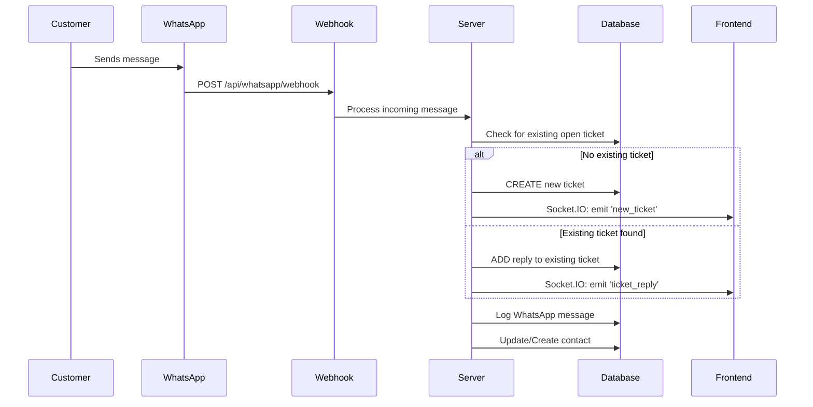
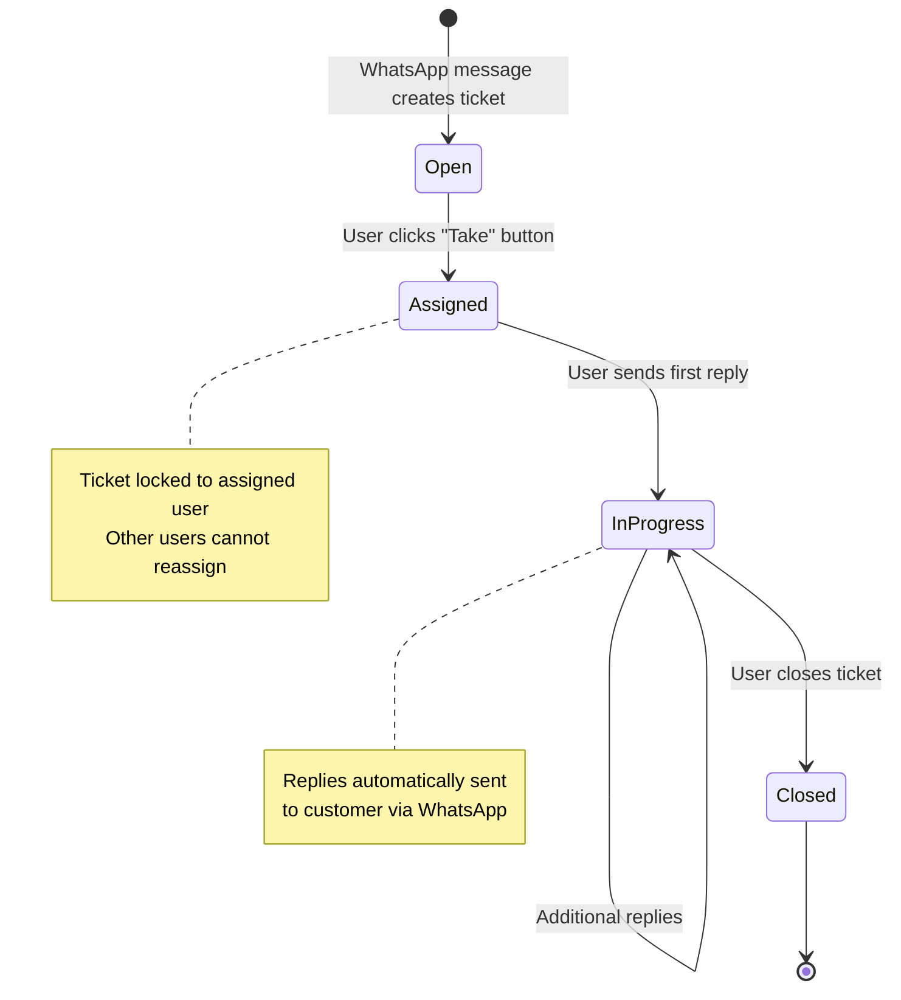

# WhatsApp Ticket System - Complete Documentation

## 🎯 Project Overview

This is a comprehensive WhatsApp-based customer support ticket system that allows customers to create support tickets by sending WhatsApp messages, and enables support users to manage, assign, reply to, and close tickets through a web interface.

## 🏗️ System Architecture

### Core Components
1. **Node.js Backend Server** - API endpoints, webhook handlers, real-time Socket.IO
2. **Angular Frontend** - User interface for ticket management  
3. **PostgreSQL Database** - Data persistence
4. **WhatsApp Business API Integration** - Two-way messaging
5. **Socket.IO** - Real-time updates across all connected clients

### Directory Structure
```
whatsApp-API/
├── server/              # Node.js backend
│   ├── server.js        # Main server file with Socket.IO
│   ├── routes/          # API route handlers
│   │   ├── auth.js      # User authentication
│   │   ├── tickets.js   # Ticket management APIs
│   │   └── whatsapp.js  # WhatsApp webhook & messaging
│   ├── database/        # Database schema and initialization
│   └── db/              # Database connection configuration
├── client/              # Angular frontend application
│   └── src/app/
│       ├── core/        # Services, guards, interceptors
│       ├── features/    # Feature modules (tickets, dashboard, etc.)
│       └── layout/      # UI layout components
├── config/              # Environment configuration
├── test-workflow.js     # Automated workflow testing script
└── docker-compose.yml   # Container orchestration
```

## 🔄 Complete Workflow Documentation

### 1. Customer Workflow (WhatsApp → Ticket Creation)



### 2. Support User Workflow (Ticket Management)



### 3. Database Schema & Relationships

```sql
-- Core Tables and Their Relationships

tickets (1) ←→ (many) ticket_replies
tickets (many) ←→ (1) users [assigned_to]
tickets (1) ←→ (many) whatsapp_messages

users (1) ←→ (many) tickets [created_by]
users (1) ←→ (many) ticket_replies [user_id]

whatsapp_contacts (1) ←→ (many) tickets [phone_number]
whatsapp_messages (many) ←→ (1) tickets [ticket_id]
```

## 🎫 Ticket State Management

### Status Flow
1. **`open`** - New ticket from WhatsApp, available for assignment
2. **`assigned`** - User has claimed the ticket (locked to that user)
3. **`in_progress`** - User has sent at least one reply
4. **`closed`** - Ticket resolved and closed

### Assignment Rules
- ✅ Only `open` tickets can be assigned
- ✅ Assignment is exclusive (no reassignment to other users)
- ✅ Only assigned user can reply to or close the ticket
- ✅ Other users can view but not modify assigned tickets

### Reply Mechanism
- User replies are automatically sent to customer's WhatsApp
- Customer replies (via WhatsApp) are added to ticket conversation
- All replies are logged with timestamps and sender identification
- Real-time updates via Socket.IO to all connected clients

## 🔌 API Endpoints

### Authentication
```
POST /api/auth/login              # User login
POST /api/auth/register           # User registration  
GET  /api/auth/profile            # Get current user profile
```

### Ticket Management
```
GET    /api/tickets               # Get all tickets (with filters)
GET    /api/tickets/:id           # Get specific ticket with replies
POST   /api/tickets/:id/assign    # Assign ticket to current user
POST   /api/tickets/:id/reply     # Send reply (saves + sends to WhatsApp)
POST   /api/tickets/:id/close     # Close ticket with resolution note
```

### WhatsApp Integration
```
POST   /api/whatsapp/webhook      # Webhook for incoming messages
GET    /api/whatsapp/webhook      # Webhook verification
GET    /api/whatsapp/status       # Connection status
POST   /api/whatsapp/send-message # Send outbound message
POST   /api/whatsapp/simulate-message # Test endpoint for simulation
```

### System Health
```
GET    /api/health                # System status and service health
```

## 🔄 Real-time Events (Socket.IO)

### Client-bound Events
```javascript
// New ticket created from WhatsApp
socket.on('new_ticket', (ticket) => {
  // Update UI with new ticket
});

// Ticket assigned to user
socket.on('ticket_assigned', (ticket) => {
  // Update ticket status in UI
});

// New reply added to ticket
socket.on('ticket_reply', (data) => {
  // Add reply to conversation in UI
});

// Ticket closed
socket.on('ticket_closed', (ticket) => {
  // Update ticket status to closed
});

// WhatsApp message sent
socket.on('whatsapp_message_sent', (data) => {
  // Confirm message delivery
});

// WhatsApp status change
socket.on('whatsapp_status_change', (status) => {
  // Update connection status
});
```

## 🛠️ Development & Testing

### Prerequisites
```bash
# Required software
- Node.js (v14+)
- Angular CLI (v15+)
- PostgreSQL (v12+)
- npm or yarn
```

### Setup Instructions
```bash
# 1. Install dependencies
cd server && npm install
cd ../client && npm install

# 2. Setup database
createdb whatsapp_tickets
psql whatsapp_tickets < server/database/init.sql

# 3. Configure environment
cp config/.env.example config/.env
# Edit config/.env with your database and WhatsApp API credentials

# 4. Start development servers
cd server && npm start     # Backend on :3000
cd client && ng serve      # Frontend on :4200
```

### Testing the Complete Workflow
```bash
# Run the automated workflow test
node test-workflow.js

# This will guide you through:
# 1. Server health check
# 2. User authentication
# 3. WhatsApp message simulation
# 4. Ticket assignment
# 5. Reply functionality
# 6. Ticket closure
```

## 📱 WhatsApp Integration Details

### Webhook Configuration
- **URL**: `https://your-domain.com/api/whatsapp/webhook`
- **Method**: POST
- **Verification**: GET with hub.verify_token

### Message Processing Logic
1. **Incoming Message** → Check for existing open ticket for phone number
   - If exists: Add as reply to existing ticket
   - If not: Create new ticket
2. **Outbound Reply** → Send via WhatsApp API + log in database
3. **Status Updates** → Track delivery/read receipts

### Message Types Supported
- ✅ Text messages (primary use case)
- 📎 Media messages (images, documents) - can be extended
- 📍 Location messages - can be extended
- 🔄 Template messages for outbound communication

## 🔐 Security & Authentication

### JWT Token-based Authentication
- Login generates JWT token
- Token required for all ticket operations
- Token includes user ID and role information
- Automatic token refresh mechanism in Angular client

### Authorization Levels
- **Users**: Can assign tickets to themselves, reply, and close
- **Admins**: Full system access (can be extended)
- **API Keys**: WhatsApp webhook authentication

## 📊 Monitoring & Analytics

### System Health Monitoring
```javascript
// Health check endpoint returns:
{
  "status": "OK",
  "timestamp": "2025-06-13T10:30:00Z",
  "services": {
    "database": "connected",
    "whatsapp": "ready",
    "socketio": "active"
  }
}
```

### Metrics Available
- Total tickets created
- Response time averages
- User assignment patterns
- WhatsApp message delivery rates
- Real-time active user count

## 🚀 Production Deployment

### Docker Deployment
```bash
# Use included docker-compose.yml
docker-compose up -d
```

### Environment Variables
```bash
# Database
DB_HOST=localhost
DB_PORT=5432
DB_NAME=whatsapp_tickets
DB_USER=postgres
DB_PASSWORD=your_password

# WhatsApp API
WHATSAPP_VERIFY_TOKEN=your_verify_token
WHATSAPP_ACCESS_TOKEN=your_access_token
WHATSAPP_PHONE_NUMBER=+1234567890

# JWT
JWT_SECRET=your_jwt_secret

# Server
PORT=3000
NODE_ENV=production
```

## 🔧 Customization & Extension

### Adding New Ticket Fields
1. Update database schema in `server/database/init.sql`
2. Modify ticket model in `server/routes/tickets.js`
3. Update Angular interfaces in `client/src/app/core/services/tickets.service.ts`
4. Add form fields in `client/src/app/features/tickets/components/`

### Adding New WhatsApp Message Types
1. Extend webhook handler in `server/routes/whatsapp.js`
2. Add message type processing in `handleIncomingMessage()`
3. Update frontend to display new message types

### Integrating with External Systems
- CRM integration points in ticket creation/closure
- Email notifications via ticket lifecycle events
- SMS backup for critical notifications
- External analytics via webhook events

## 🐛 Troubleshooting Guide

### Common Issues
1. **WhatsApp webhook not receiving messages**
   - Check webhook URL configuration
   - Verify SSL certificate
   - Confirm verify token matches

2. **Socket.IO connection issues**
   - Check CORS configuration
   - Verify client connection URL
   - Monitor connection logs

3. **Database connection errors**
   - Verify PostgreSQL is running
   - Check connection credentials
   - Confirm database exists and schema is applied

4. **Authentication failures**
   - Check JWT secret configuration
   - Verify token expiration settings
   - Monitor token refresh mechanism

### Debug Mode
```bash
# Enable debug logging
DEBUG=* node server.js

# Angular development mode
ng serve --configuration=development
```

## 📝 AI Agent Integration Notes

### For AI Agents Understanding This System

1. **Primary Data Flow**: WhatsApp → Webhook → Database → Frontend
2. **Key State Transitions**: open → assigned → in_progress → closed
3. **Critical Business Rules**: 
   - No ticket reassignment once assigned
   - All replies must go to WhatsApp
   - Real-time updates required for user experience

4. **Extension Points**:
   - Add new ticket fields in database + API + frontend
   - Integrate external APIs in webhook handlers
   - Add new notification channels via Socket.IO events

5. **Testing Strategy**: Use `test-workflow.js` to validate end-to-end functionality

### Common Modification Patterns
- **New Features**: Add to API → Update frontend service → Create/modify components
- **Database Changes**: Update schema → Modify models → Update interfaces
- **WhatsApp Features**: Extend webhook → Add message handlers → Update frontend

This documentation provides a complete understanding of the system architecture, workflow, and implementation details for both human developers and AI agents working on this project.